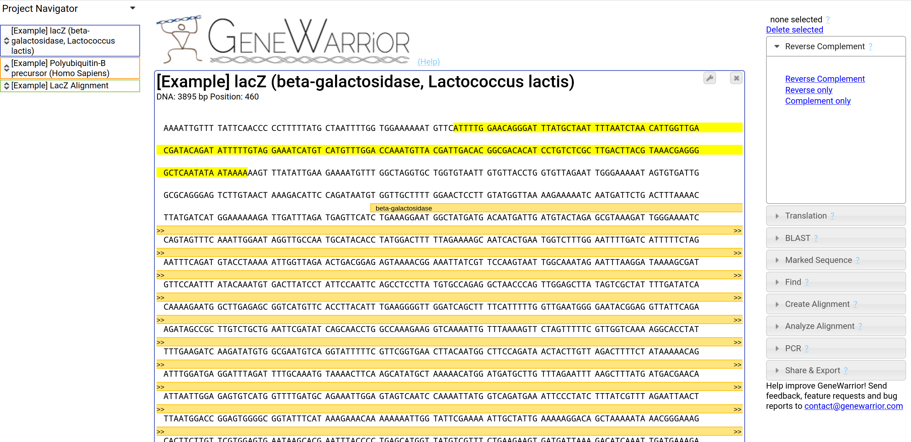

# [GeneWarrior](http://genewarrior.com)



## What is it about

GeneWarrior is an online DNA and protein sequence manipulation tool to perform common tasks such as managing sequences,
calculating the reverse complement of a sequence, translating nucleotide to protein sequences, creating alignments,
sequence logos, phylogenetic trees and designing PCR primers.

It's designed to be very accessible (basically: paste your sequences into the website, do your manipulations, copy the
result from the website), perform the common actions with a few clicks and be done within seconds, and this with a
(hopefully)
clear user interface.

## What does it do?

GeneWarrior is hosted on [GeneWarrior.com](http://genewarrior.com), try it out.

Take a look at the tutorial video
on [how to design PCR primers with GeneWarrior on Youtube](https://www.youtube.com/watch?v=Tt5Lo7cTSK0).

There are a couple of tutorials available on how to perform the important
actions [here](http://genewarrior.com/docs/index.jsp),
such
as [designing PCR primers](http://genewarrior.com/docs/tut_primerdesign.jsp), [get the reverse complement sequence](http://genewarrior.com/docs/tut_revcomp.jsp),
[translate DNA into amino acid sequences](http://genewarrior.com/docs/tut_translation.jsp), [align sequences](http://genewarrior.com/docs/tut_createalignment.jsp),
and [creating consensus sequences, phylogenetic trees and sequence logos from alignments](http://genewarrior.com/docs/tut_analyzealignment.jsp).

## Technical and Historical Background

GeneWarrior was developed in 2014-2015 heavily relying on tech stacks that were fancy back than:
the backend was based on Java Servlets and Java Servlet Pages, the front end on jQuery.

The application is hosted from the beginning on a small DigitalOcean droplet where it does its job faithfully
since approx. 9 years and running. I (and judging from the web analytics a handful of other users) have
been relying on it for day-to-day needs that occur in a biotech company on a regular basis, e.g.
for quickly comparing a couple of sequence, translate DNA sequences to proteins etc.

In early 2023, I finally got around to opensource the code. I did some very basic and superficial modernization,
which consists mainly of porting everything from Java Servlets to Spring Boot. The original servlet backend
was handling raw `HttpServletRequest` and `HttpServletResponse` objects, whereas Spring Boot makes the job
much cleaner. Furthermore, database handling for sharing projects now also relies on Spring Boot JPA.

The actual DNA and Protein sequence is handled by a subset of my [GeneTools](https://github.com/r-follador/GeneTools)
library (which is even older, think of it as a self-made BioJava).

### The Good

Judging from the hosted application that is running since years with only minor maintenance,
the app is very stable, reliable and fast on a compute instance with half a GB memory.

Another upside is that the server is completely stateless, state is handled entirely by the client.
So no fancy session management is needed, which would allow easy scalability.

### The Bad and the Ugly

Mainly: code quality represents my state of knowledge from approx. 9 years ago and also the fact
that the code was partially written on the beaches of Indonesia.

Basically there's a single endpoint that receives a JSON request, where the type of action (e.g.
reverse complement or alignment etc.) is defined as a member property. This was convenient with Servlets when handling
raw `HttpServletRequest`s, but the lack of separation makes the code not very nice to read
(also on the frontend).

I have not updated the frontend (which includes -don't laugh- jQuery v1.11), that would definitely
be next on the To Do list. Nowadays pretty much everything where jQuery was required is doable in
plain JavaScript with the same amount of code.

## How to install

This repository is a Spring Boot project created in IntelliJ IDEA (Java 17) with Gradle.

### Bare Metal Installation

#### PostgreSQL

Needed to enable project sharing (the user clicks a button and gets a link with a key in order
to share the sequences and alignments).

You need to create a PostgreSQL database called `genewarrior` and a user called `genewarrior` with
following password `genewarrior_password`, or change it accordingly in the *application.properties* file.

``` bash
## install postgresql
sudo apt-get install postgresql postgresql-contrib 
##create a genewarrior database and user, change password and grant privileges:
sudo -i -u postgres
creatdb genewarrior
createuser genewarrior
psql
AlTER USER genewarrior PASSWORD 'genewarrior_password';
grant all privileges on database genewarrior to genewarrior;
```

#### Software requirements

Following software needs to be installed for alignments, weblogo and primer design.

Use `/home/genewarrior/bin/` as installation directory, or change it accordingly in the *application.properties* file.

GeneWarrior calls these programs as a `Process`.

- Primer3 https://github.com/primer3-org
- WebLogo 3 https://github.com/WebLogo/weblogo
- Muscle http://www.drive5.com/muscle/

### Docker Installation

This is quite rough, but it should give you a running application in a single command.

#### Requirements

- docker
- docker-compose

#### Setup

```shell
docker-compose up
```

#### Use

The application will be available at [localhost:8080](http://localhost:8080)


